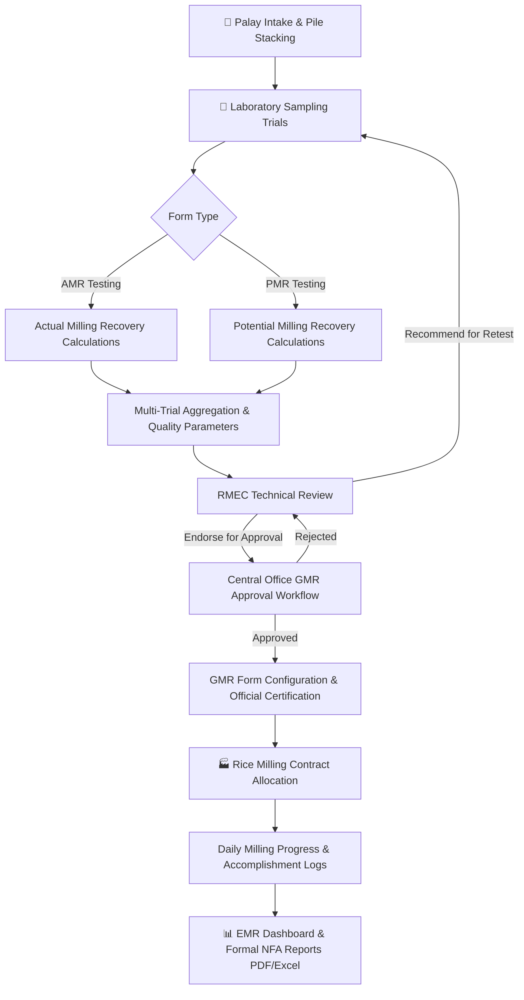

<div align="center">

  

  # National Food Authority — GMR System
  ### Guaranteed Milling Recovery Management, Quality Testing & Monitoring Platform

  [](https://laravel.com)
  [](https://php.net)
  [](https://tailwindcss.com)
  [](https://vitejs.dev)
  [](https://mysql.com)
  [](LICENSE)

  <br />

  [](https://github.com/sponsors/playpixelpro)
  [](https://ko-fi.com/playpixelpro)
  [](https://patreon.com/playpixelpro)
  [](https://buymeacoffee.com/playpixelpro)

  <p align="center">
    <strong>A secure, enterprise-grade web application engineered for the National Food Authority (NFA) to standardize grain quality evaluation, calculate Actual & Potential Milling Recoveries, supervise commercial rice milling contracts, and facilitate multi-tiered regional and central office approvals.</strong>
  </p>

</div>

---

## 📑 Table of Contents

- [Overview](#-overview)
- [Workflow Architecture](#-workflow-architecture)
- [Key Features](#-key-features)
- [Role-Based Access Control (RBAC)](#-role-based-access-control-rbac)
- [Technology Stack](#-technology-stack)
- [System Requirements](#-system-requirements)
- [Local Development Setup](#-local-development-setup)
- [Environment Configuration](#-environment-configuration)
- [Production Deployment](#-production-deployment)
- [Testing & Quality Assurance](#-testing--quality-assurance)
- [Sponsorship & Support](#-sponsorship--support)
- [License](#-license)

---

## 🔭 Overview

The **NFA GMR (Guaranteed Milling Recovery) System** automates the end-to-end evaluation and management of palay (paddy rice) stocks and milling recoveries across NFA branches and warehouses. 

It replaces manual logging and disparate spreadsheets with a unified, auditable platform that:
- Captures multi-trial laboratory analyses (moisture, purity, foreign matter, chalky/damaged grains, broken rice).
- Computes standard **AMR (Actual Milling Recovery)** and **PMR (Potential Milling Recovery)** figures.
- Derives aggregate **EMR (Estimated Milling Recovery)** benchmarks.
- Orchestrates formal **RMEC (Regional / Monitoring Evaluation Committee)** recommendations and **Central Office GMR Approvals**.
- Monitors commercial rice miller performance, batch allocations, and real-time accomplishment milestones.

---

## 🔄 Workflow Architecture



---

## ✨ Key Features

### 🧪 1. Laboratory Grain Quality Testing
- **Multi-Trial Data Entry**: Intuitive forms for recording detailed trial batches (gross weights, purity, moisture content, foreign matter, yellow/chalky grains, red rice, and head rice recovery).
- **Dynamic Renumbering**: Built-in automated re-indexing of trial sets upon adjustments or removal of trial rows.
- **Retest Triggers**: Formal mechanisms to initiate re-sampling workflows when quality thresholds deviate from standards.

### 📈 2. Advanced Recovery Analytics & Dashboards
- **AMR & PMR Analysis**: Automated formula execution with validation checks against allowable tolerances.
- **EMR Executive Dashboard**: Centralized performance metrics aggregating recovery estimates across branches, warehouses, and piles.
- **Dynamic Signatories & Column Customization**: Tailor printable GMR certificates with configurable authority signatures and toggleable report fields.

### 🏭 3. Commercial Milling Operations
- **Contractor & Miller Directory**: Maintain profiles, accreditation statuses, and milling capacities.
- **Batch & Pile Tracking**: Allocate specific palay piles to milling batches.
- **Progress Tracking**: Daily accomplishment logs recording milled volumes, recovery percentages, and outstanding balances.

### 🛡️ 4. Enterprise Security & Administration
- **Granular RBAC**: 4 distinct clearance tiers (`ADMINISTRATOR`, `RMEC`, `STAFF`, `VIEWER`).
- **Audit Logging**: Comprehensive activity tracking recording user actions, timestamps, and model mutations.
- **Brute-Force & IP Lockout**: Built-in IP throttling with administrative unblock controls.
- **Credential Governance**: Mandatory password change on initial login, expiring temporary credentials, and secure reset links.
- **Safe Hierarchical Cleanup**: Restricted administrative bottom-up data purge (Trials → Piles → Warehouses) with immutable audit events.

### 📄 5. Compliant Document Generation
- **Spreadsheet Exports**: Excel exports formatted via **PhpSpreadsheet**.
- **Print-Ready PDFs**: Vector-rendered, agency-compliant print formats via **Barryvdh DomPDF**.

---

## 👥 Role-Based Access Control (RBAC)

| Capability / Module | Administrator | RMEC | Staff | Viewer |
|:---|:---:|:---:|:---:|:---:|
| **Grain Quality Data Entry (AMR/PMR)** | ✅ | ✅ | ✅ | ❌ |
| **View AMR, PMR, & GMR Summaries** | ✅ | ✅ | ✅ | ✅ |
| **Export AMR / PMR Reports (Excel/PDF)** | ✅ | ✅ | ✅ | ❌ |
| **Export EMR Dashboard & Reports** | ✅ | ✅ | ❌ | ❌ |
| **Configure GMR Signatories & Columns** | ✅ | ✅ | ❌ | ❌ |
| **Print Official GMR Report** | ✅ | ✅ | ❌ | ❌ |
| **Central-Office GMR Approvals** | ✅ | ✅ | ❌ | ❌ |
| **Manage Millers & Milling Allocations** | ✅ | ✅ | ❌ | ❌ |
| **Log Milling Progress / Accomplishment** | ✅ | ✅ | ✅ | ❌ |
| **User Administration & Security Settings** | ✅ | ❌ | ❌ | ❌ |
| **Bottom-Up Safe Data Cleanup** | ✅ | ❌ | ❌ | ❌ |

---

## 🛠️ Technology Stack

- **Backend Framework**: [Laravel 13.x](https://laravel.com)
- **Language Runtime**: [PHP 8.3+](https://php.net)
- **Database Engine**: [MySQL 8.0+](https://www.mysql.com)
- **Frontend Toolkit**: [Tailwind CSS](https://tailwindcss.com), [Vite](https://vitejs.dev), [Alpine.js](https://alpinejs.dev)
- **Document Processors**:
  - [Barryvdh Laravel DomPDF](https://github.com/barryvdh/laravel-dompdf) (Official PDF reports)
  - [PhpOffice PhpSpreadsheet](https://github.com/PHPOffice/PhpSpreadsheet) (Data exports)
- **Mailing Engine**: [Brevo SMTP Relay](https://www.brevo.com)
- **Code Quality & Testing**: [Laravel Pint](https://laravel.com/docs/pint), [PHPUnit 12](https://phpunit.de)

---

## 📋 System Requirements

Ensure the host environment satisfies the following baseline prerequisites:

- **PHP**: `^8.3` (with `bcmath`, `ctype`, `curl`, `dom`, `fileinfo`, `gd`, `mbstring`, `openssl`, `pdo_mysql`, `tokenizer`, `xml`, `zip` extensions)
- **Composer**: `^2.7`
- **Node.js**: `^20.x` or `^22.x` & **npm**
- **Database**: MySQL `^8.0` or MariaDB `^10.5`
- **SMTP Service**: A verified Brevo account with API/SMTP relay credentials

---

## 🚀 Local Development Setup

Follow these steps to configure and run the application locally:

### 1. Clone & Install Dependencies

```bash
git clone https://github.com/playpixelpro/GMR-System.git
cd GMR-System

# Install PHP dependencies
composer install

# Install JavaScript dependencies
npm install
```

### 2. Environment Configuration

Copy the example environment template:

```bash
# macOS / Linux / Git Bash
cp .env.example .env

# Windows PowerShell
Copy-Item .env.example .env
```

Generate the cryptographic application key:

```bash
php artisan key:generate
```

### 3. Database & Initial Seeder Credentials

Create a MySQL database (e.g., `nfa_gmr`), then configure `.env`:

```dotenv
DB_CONNECTION=mysql
DB_HOST=127.0.0.1
DB_PORT=3306
DB_DATABASE=nfa_gmr
DB_USERNAME=root
DB_PASSWORD=your_password
```

Define initial administrator credentials in `.env` (*required for initial seeding; must be at least 16 characters*):

```dotenv
NFA_ADMIN_EMAIL=administrator@example.com
NFA_ADMIN_PASSWORD=SetAStrongPasswordWith16+Chars!
```

Execute migrations and database seeders:

```bash
php artisan migrate --seed --no-interaction
```

> [!TIP]
> To reset and seed a fresh database at any time during development:
> ```bash
> php artisan migrate:fresh --seed --no-interaction
> ```

### 4. Configure Mail (Brevo SMTP)

Update email settings in `.env` to test password resets and account confirmations:

```dotenv
MAIL_MAILER=brevo
MAIL_FROM_ADDRESS=verified-sender@yourdomain.com
MAIL_FROM_NAME="${APP_NAME}"

BREVO_SMTP_HOST=smtp-relay.brevo.com
BREVO_SMTP_PORT=587
BREVO_SMTP_SCHEME=tls
BREVO_SMTP_USERNAME=your-brevo-login
BREVO_SMTP_PASSWORD=your-brevo-master-key
BREVO_SMTP_EHLO_DOMAIN=yourdomain.com
```

### 5. Compile Assets & Start Services

```bash
# Build frontend assets
npm run build

# Start the local development server
php artisan serve
```

For live asset hot-reloading during UI development, execute:

```bash
npm run dev
```

Visit the application at `http://127.0.0.1:8000`.

---

## ⚙️ Environment Configuration

### Avatar Resolution Options

User avatars resolve through a three-stage cascade:
1. **Local Uploaded Avatar**: File stored in application storage.
2. **Gravatar**: SHA-256 hash lookup of the user's email address (no plain-text email transmitted).
3. **Generated Fallback**: Monogram/initials avatar.

To disable external Gravatar queries entirely, toggle:

```dotenv
GRAVATAR_ENABLED=false
```

---

## 🌐 Production Deployment

### 1. Optimized Installation

```bash
composer install --no-dev --optimize-autoloader
npm ci
npm run build
```

### 2. Environment Hardening

Ensure the following variables are strictly set on your production server:

```dotenv
APP_ENV=production
APP_DEBUG=false
APP_URL=https://gmr.yourdomain.gov.ph
```

### 3. Migrations & Cache Optimization

Run the production deployment routine:

```bash
# Apply schema updates
php artisan migrate --force

# Establish public symbolic link for avatars and assets
php artisan storage:link

# Cache configuration, routes, and views for peak performance
php artisan optimize
```

If initializing a brand-new production database, seed the initial administrator:

```bash
php artisan db:seed --force
```

### 4. Web Server Security

> [!IMPORTANT]
> Configure your web server (Nginx / Apache / Caddy) document root to point strictly to the `public/` directory. **Never** expose the repository root directory or the `.env` file to the web.

---

## 🧪 Testing & Quality Assurance

Maintain strict code reliability and formatting standards before pushing modifications:

```bash
# Run feature and unit test suites
php artisan test --compact

# Run test suite with PHPUnit directly
vendor/bin/phpunit

# Automatically format code to adhere to Laravel Pint standards
vendor/bin/pint --format agent
```

---

## 💖 Sponsorship & Support

The GMR System is maintained and developed by **playpixelpro**. If this platform assists your agency or organization, please consider supporting future maintenance and development:

<div align="center">

  [](https://github.com/sponsors/playpixelpro)
  [](https://ko-fi.com/playpixelpro)
  [](https://patreon.com/playpixelpro)
  [](https://buymeacoffee.com/playpixelpro)

</div>

---

## 📄 License

This software is released under the terms of the [MIT License](LICENSE).
